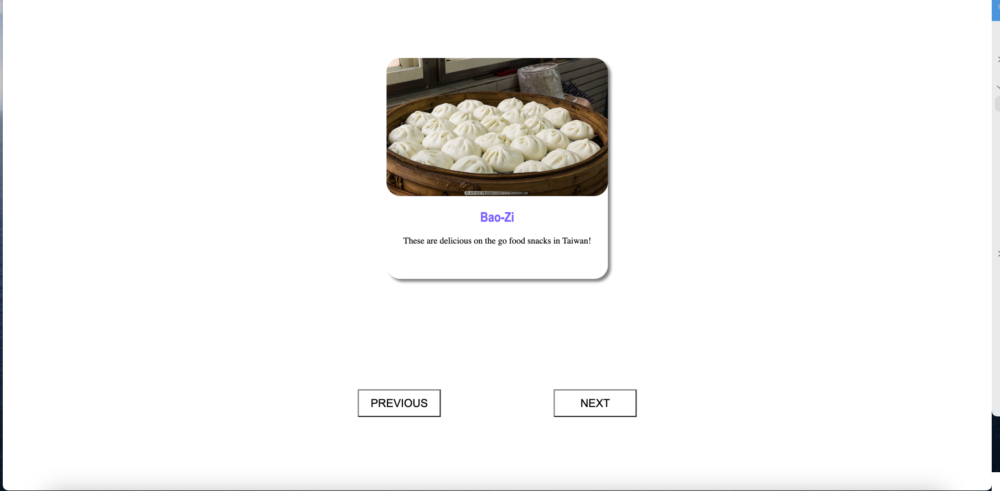

# Slider Skill Assesment
  
  ## ReadMe Description 

  This was a skill assessment to create a slider that moves between slides 
  ## Table of Contents: 

  * [Installation](#installation) 

  * [Contributors](#contributors) 

  * [Usage](#usage) 

  * [Tests](#tests) 

  * [Questions](#questions) 

  * [License](#license) 

  ## Name: 

  Sebastian Tischner
  ## Installation 

  No Install
  ## Contributors 

  Fork Repository
  ## Usage 

  Click next to move forward in the carousel, previous to move back. 
  ## Tests 

  None
  ## License 
 
  This project is protected by the MIT license.
  ## Questions 

  Github: [Sebascrab](https://github.com/Sebascrab) 

  Email: alexanders.tischner@outlook.com 

  

  

